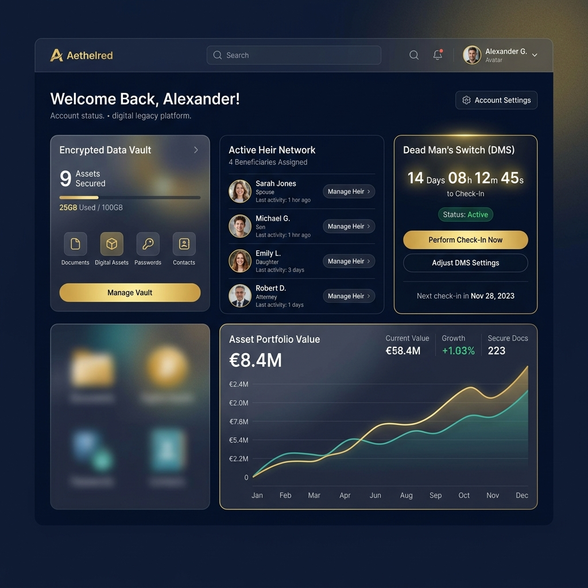

# 🛡️ Digital Legacy Platform
### Military-Grade Digital Inheritance & Estate Management

[](https://opensource.org/licenses/MIT)
[](https://www.djangoproject.com/)
[](https://reactjs.org/)
[](https://www.docker.com/)

**Digital Legacy** is a secure, premium digital inheritance platform designed to protect your most valuable assets and ensure they reach your loved ones when it matters most. By combining cutting-edge **AES-256-GCM encryption** with an automated **"Dead Man's Switch" (DMS)**, we bridge the gap between absolute security and eventual accessibility.



---

## 💎 The Premium Experience

### 🌑 Navy & Gold Design System
Experience a high-fidelity interface built on **Glassmorphism** principles. Our custom design system uses deep navy tones and gold accents to provide a sense of prestige, security, and trust.
- **Glassmorphism:** Translucent panels with precise backdrop blurs.
- **Micro-animations:** Subtle feedback for every interaction.
- **Real-time Dashboard:** Live synchronization of DMS timers and security health scores.

### 🔐 Multi-Channel Security
We prioritize accessibility without compromising safety:
- **Dual-Channel Auth:** Register and login using either **Email** or **Phone Number**.
- **Live Notifications:** Real-time OTP delivery via **Twilio (SMS)** and **Gmail (SMTP)**.
- **Zero-Knowledge Architecture:** Sensitive vault items are secured using client-side derived AES-256-GCM keys.

---

## 🌟 Key Features

| Feature | Description |
| :--- | :--- |
| **🛡️ Secure Vault** | Store legal documents, credentials, and sensitive messages with industry-standard encryption. |
| **⏲️ Dead Man's Switch** | Automated monitoring system that triggers asset release after a configurable period of inactivity. |
| **📲 Multi-Channel Auth** | Authentication support for both Mobile (SMS) and Email channels. |
| **💌 Memories** | A dedicated space for personal photos and messages to be shared with heirs after you're gone. |
| **👥 Heir Management** | Precise control over who inherits which assets, with built-in relationship verification logic. |
| **📜 Security Ledger** | Immutable audit logs of all vault accesses, configuration changes, and system events. |
| **💓 Heartbeat System** | Simple one-click "Proof of Life" to reset your inactivity timers and keep your vault locked. |

---

## 🚀 Quick Start

### 1. Environment Configuration
Create a `.env` file from the provided template and configure your live credentials:
```bash
# Messaging Services
EMAIL_HOST_USER=your-email@gmail.com
EMAIL_HOST_PASSWORD=your-app-password
TWILIO_ACCOUNT_SID=your-sid
TWILIO_AUTH_TOKEN=your-token
TWILIO_PHONE_NUMBER=your-twilio-number

# Encryption
ENCRYPTION_KEY=your-32-byte-hex-key
```

### 2. Local Development (Windows/Manual)
```bash
# Backend Setup
python -m venv venv
source venv/bin/scripts/activate
pip install -r requirements.txt
python manage.py migrate
python manage.py runserver

# Frontend Setup
cd frontend
npm install
npm run dev
```

### 3. Docker Deployment
```bash
docker-compose up --build -d
```

---

## 🛠️ Technology Stack

| Layer | Technologies |
| :--- | :--- |
| **Frontend** | React 18, TypeScript, Vite, Zustand, Lucide React, Vanilla CSS |
| **Backend** | Django 6.0, Django REST Framework, Python 3.14 |
| **Async Tasks** | Celery (with Local Memory/Redis Fallback) |
| **Database** | PostgreSQL 15 |
| **Messaging** | Twilio (SMS), Gmail SMTP (Email) |

---

## 📂 Architecture

```bash
digital-legacy-web/
├── apps/               # Core Modules (Auth, Vault, DMS, Beneficiaries, Notifications)
├── core/               # Shared Security Utilities & Middleware (Audit, Exceptions)
├── frontend/           # React + Vite (Custom Design System & State Management)
├── config/             # Django & Celery Project Configuration
└── docs/               # Documentation & Visual Assets
```

---

## ☁️ Deployment
Detailed production deployment guides for AWS and other cloud providers are available:
- 📦 [AWS Deployment Guide](./AWS_DEPLOYMENT.md)
- 🚀 [General Deployment Overview](./DEPLOYMENT.md)

---

### 🎓 Academic Context
*Developed by **Group 16** | Department of Computer Engineering*
**Ahmadu Bello University, Zaria**
*May 2026*